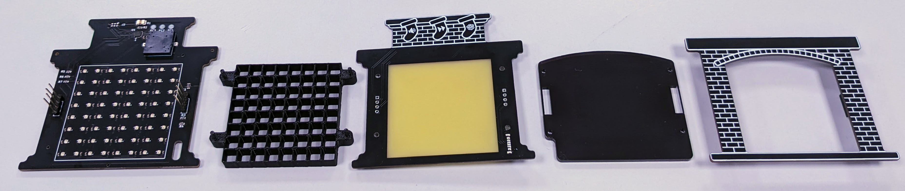

# Merry Christmas!

And a happy new year! Here you will find some instructions for the christmas card, as well as some technical details.

https://github.com/johanwheeler/ch32-fireplace/assets/45564940/a2e65534-c451-412c-9a83-9337bf3cca4e

## Instructions

USB-C: Connect to any USB-C power source. 

Buttons: The stockings above the fire are actually touch buttons! Press firmly to interact.

Sound: Toggle sound on or off. 

Next: Go to next animation.

Present: Call for santa. Remember that santa will only deliver presents at night ;)

## Technical details

For fellow nerds.

### Mechanical design

The initial shape was made in Fusion360, together with the grid and acrylic piece. The outlines were then imported into Inkscape, where the graphics were designed.  

### Electrical design

The outlines were imported into Kicad, where the PCBs were designed. 

The main electrical components are:

 - CH32V003 RISC-V microcontroller
 - WS2812B LED matrix with 64 pixels
 - Buzzer for sound
 - Capacitive touch buttons
 - Photoresistor

These are distributed on 3 PCBs for a 3D effect:

 - Back PCB has most of the components including MCU, Buzzer, LEDs, and programming headers.
 - Middle PCB has a USB-C port and capacitive buttons. Exposed FR-4 is used as a diffuser for the LEDs. 
 - Front PCB just looks nice.

### Assembly

The project is assembled in several steps that need to be followed in the correct order.

 - Components on back PCB
 - Upload code (on back PCB)
 - USB-C jack on middle PCB
 - Grid and acrylic on middle PCB
 - Solder middle PCB to back PCB headers.
 - Solder female headers on front PCB.
 - Attach front PCB.
 - Plug in and enjoy!

### Code

All code was written in plain C using the ch32v003fun dev environment and can be compiled using PlatformIO. The main code can be found in [src/main.c](SW/fireplace-PIO/src/main.c), and several peripheral drivers and functions can be found in the [lib](SW/fireplace-PIO/lib/) folder. 

## Contributions

The people who made this:

 - Johan Wheeler (@johanwheeler): Electrical design, mechanical design, assembly.
 - Daniel Quach (@Muoshy): Project lead, electrical design, programming, animations, soldering.
 - Adam Anderson (@adaand00): Mechanical design, assembly, programming, animations. 

Additional "thank you"s to:

@CNLohr and contributors for the great resources in [ch32v003fun](https://github.com/cnlohr/ch32v003fun/tree/master).

CASE (Chalmers Autonomous Sytems and Electronics) for PCB shipping, tools, and workspace. 
