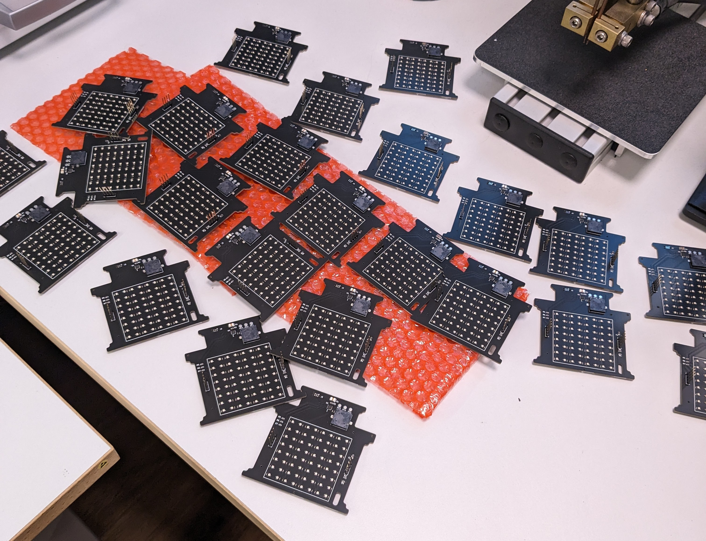

# Merry Christmas!

And a happy new year! Here you will find some instructions for the christmas card, as well as some technical details. 

https://github.com/johanwheeler/ch32-fireplace/assets/45564940/a2e65534-c451-412c-9a83-9337bf3cca4e

# Instructions

If your card has white plastic in front of the screen, remove the front plate and peel the film, then connect to any USB-C power source. The stockings above the fire are actually touch buttons! Press firmly to interact.

Sound: Toggle sound on or off. 

Next: Go to next animation.

Present: Call for santa. Remember that santa will only deliver presents at night ;)

# Technical details

For fellow nerds.

## Mechanical design

The initial shape was made in Fusion360, together with the grid and acrylic piece. The outlines were then imported into Inkscape, where the graphics were designed. To save ourselves a lot of work during the assembly process, we put an effort into minimizing part count as much as possible. We did this by combining multiple functions into one part, for example the middle PCB serves as decoration, diffuser for the LEDs, and also has buttons integrated. This way we managed to get all the looks and functionality with only 5 major mechanical components, saving us a lot of work when we eventually assembled all 50 of these.

## Electrical design

The main electrical components are:

 - CH32V003 RISC-V microcontroller
 - WS2812B (neopixel) LED matrix with 64 pixels
 - Buzzer for music and sound effects
 - Capacitive touch buttons
 - Photoresistor

These are distributed on 3 PCBs for a 3D effect, KiCAD was used to design the PCBs:

 - Back PCB has most of the components including MCU, Buzzer, LEDs, and programming headers.
 - Middle PCB has a USB-C port and capacitive buttons. Exposed FR-4 is used as a diffuser for the LEDs. 
 - Front PCB just looks nice.

## Assembly

The project is assembled in several steps that need to be followed in the correct order.

 - Components on back PCB.
 - Upload code (on back PCB).
 - Attach USB-C jack and grid on middle PCB.
 - Solder middle PCB to back PCB headers.
 - Attach acrylic on middle PCB.
 - Solder female headers on front PCB.
 - Attach front PCB.
 - Plug in and enjoy!

We got all of the back PCB smd components assembled by JLCPCB. We then set up a mini production line over the weekend and made 50 of these to give away to friends and family. The final cost came out to around 6$ per fireplace, manageable even with our student budgets. 

## Code

All code was written in plain C using the ch32v003fun dev environment and can be compiled using PlatformIO. The main code can be found in [src/main.c](SW/fireplace-PIO/src/main.c), and several peripheral drivers and functions can be found in the [lib](SW/fireplace-PIO/lib/) folder. The fire is procedurally generated, and the christmas tree has some math for the fading lights, otherwise the animations are stored frame by frame on the device. We really managed to squeeze a lot of functionality onto the 10 cent chip, with the code, animations and music filling up more than 90 percent of the 16k flash. 

# Contributions

This was a really fun project to do, and we learned a lot about small-scale production with limited budget and a tight deadline.

The people who made this:

 - Johan Wheeler (@johanwheeler): Electrical design, mechanical design, assembly.
 - Daniel Quach (@Muoshy): Project lead, electrical design, programming, animations, soldering.
 - Adam Anderson (@adaand00): Mechanical design, assembly, programming, animations. 

[See past years' cards!](https://github.com/Muoshy/christmas-cards)

Additional thanks to:

@CNLohr and contributors for the great resources in [ch32v003fun](https://github.com/cnlohr/ch32v003fun/tree/master).

CASE (Chalmers Autonomous Sytems and Electronics) for PCB shipping, tools, and workspace. 
